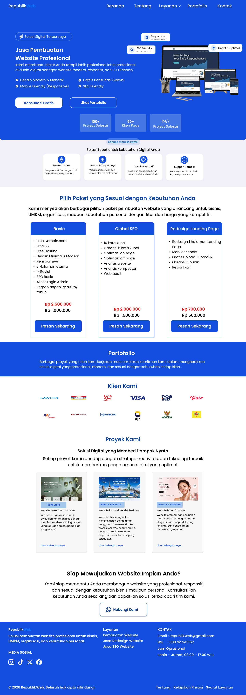
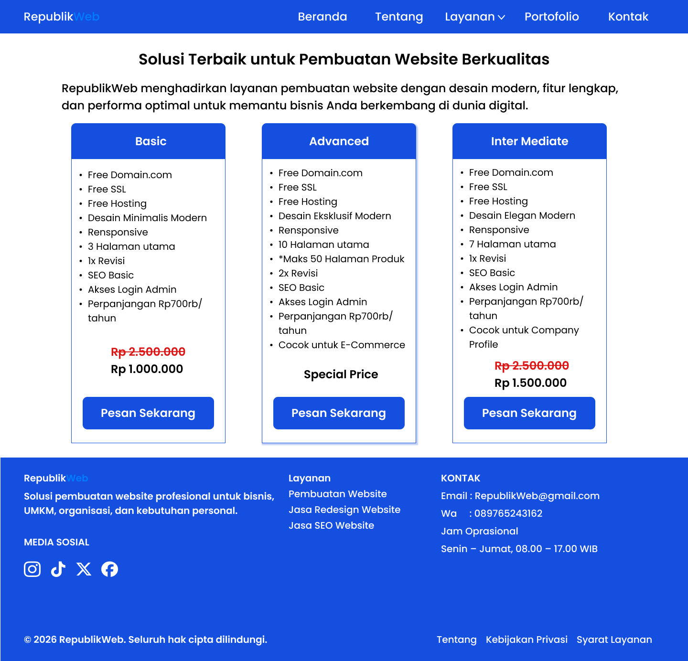
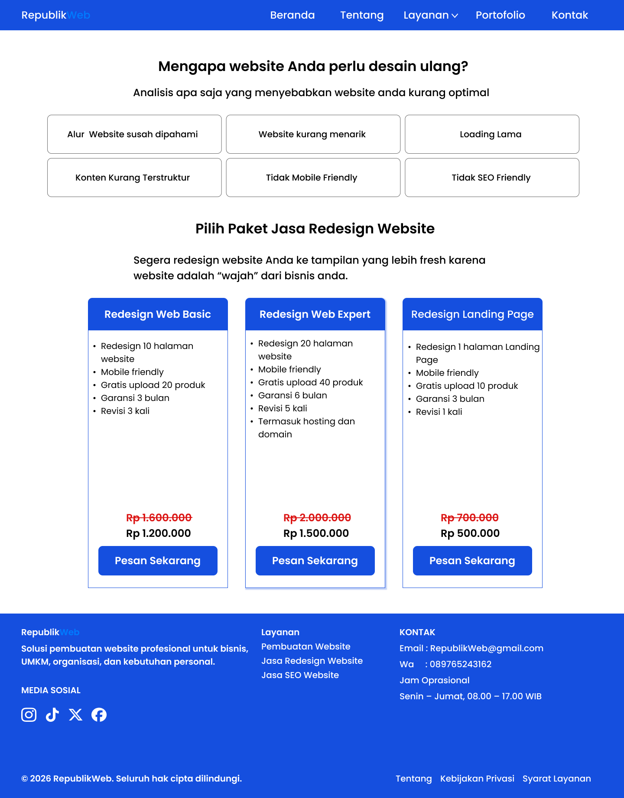
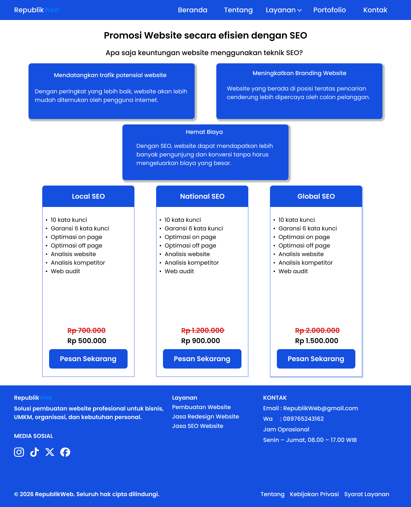
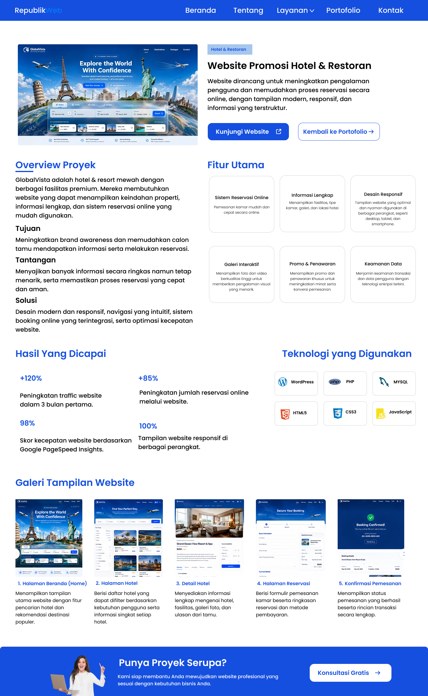

  

# 🌐 Digital Agency Website

Website Company Profile modern yang menyediakan layanan *Website Development, **Website Redesign, dan **SEO Optimization* dengan tampilan profesional, modern, dan responsif.

 

---

# 📖 Table of Contents

- 🏠 Landing Page
- 💻 Website Development
- 🎨 Website Redesign
- 🚀 SEO Optimization
- 📂 Detail Project
- ✨ Features

---

# 🏠 Landing Page

> Halaman utama yang menampilkan Hero Section, layanan unggulan, Call To Action, serta informasi perusahaan secara profesional.

⭐⭐⭐⭐⭐

---

# 💻 Website Development

Website profesional yang dapat digunakan untuk:

- Landing Page
- Company Profile
- Portfolio
- Website UMKM
- Corporate Website

---

# 🎨 Website Redesign

Mengubah tampilan website lama menjadi lebih modern melalui peningkatan:

- UI Design
- UX Design
- Website Performance
- Responsive Layout

---

# 🚀 SEO Optimization

Layanan optimasi SEO meliputi:

- Keyword Optimization
- Technical SEO
- On-Page SEO
- Performance Optimization

---

# 📂 Detail Project

Halaman detail proyek menampilkan informasi lengkap mengenai setiap layanan beserta proses pengerjaan dan teknologi yang digunakan.

---

# ✨ Features

| 🚀 Feature | 📄 Description |
|------------|----------------|
| 🎨 Modern UI | Desain modern dan elegan |
| 📱 Responsive | Tampilan optimal di Mobile, Tablet, dan Desktop |
| ⚡ Fast Loading | Website memiliki performa tinggi |
| 🔍 SEO Friendly | Dioptimalkan agar mudah ditemukan di Google |
| 💼 Professional | Cocok untuk Company Profile maupun Digital Agency |
| 📞 Contact Form | Form konsultasi dengan calon pelanggan |

---

## ❤️ Thanks for Visiting

  

