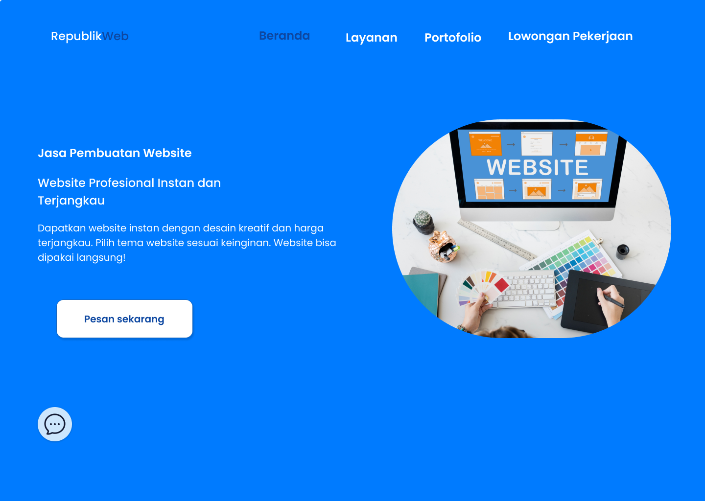
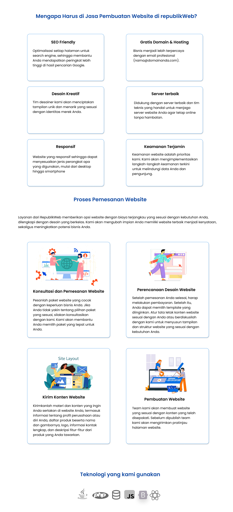
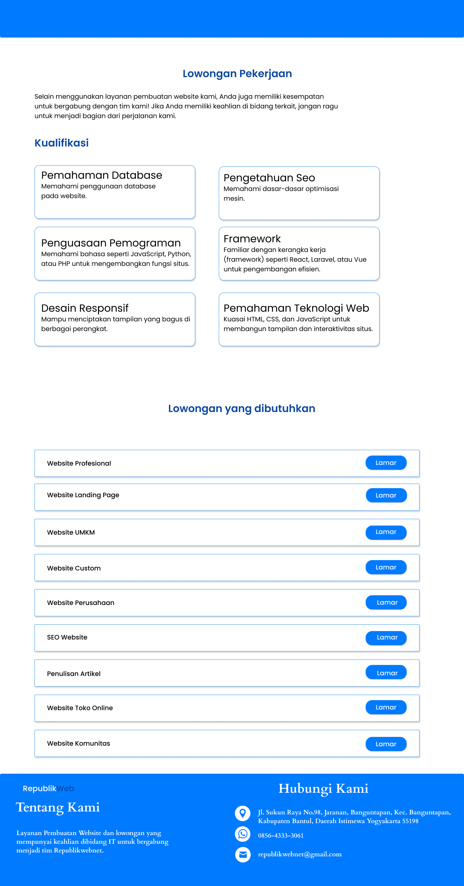
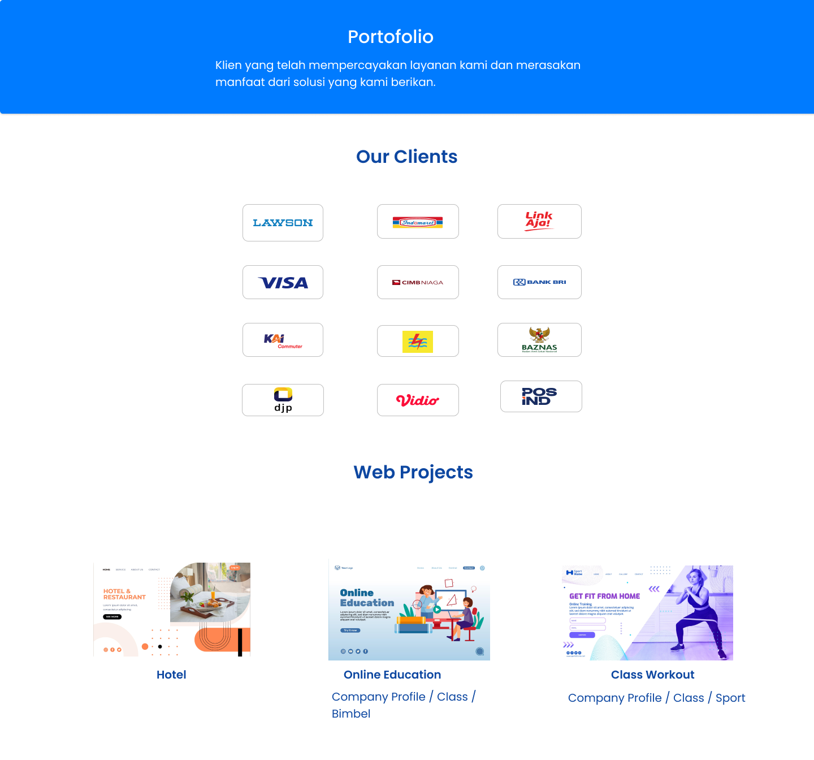
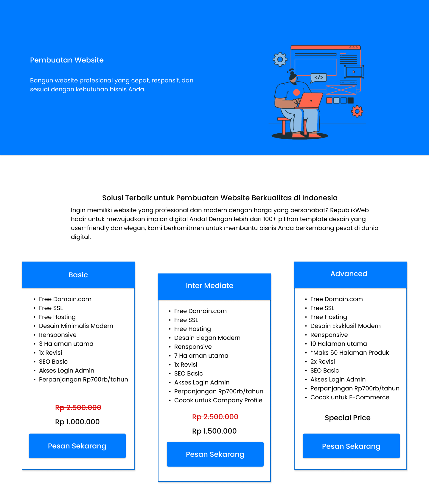
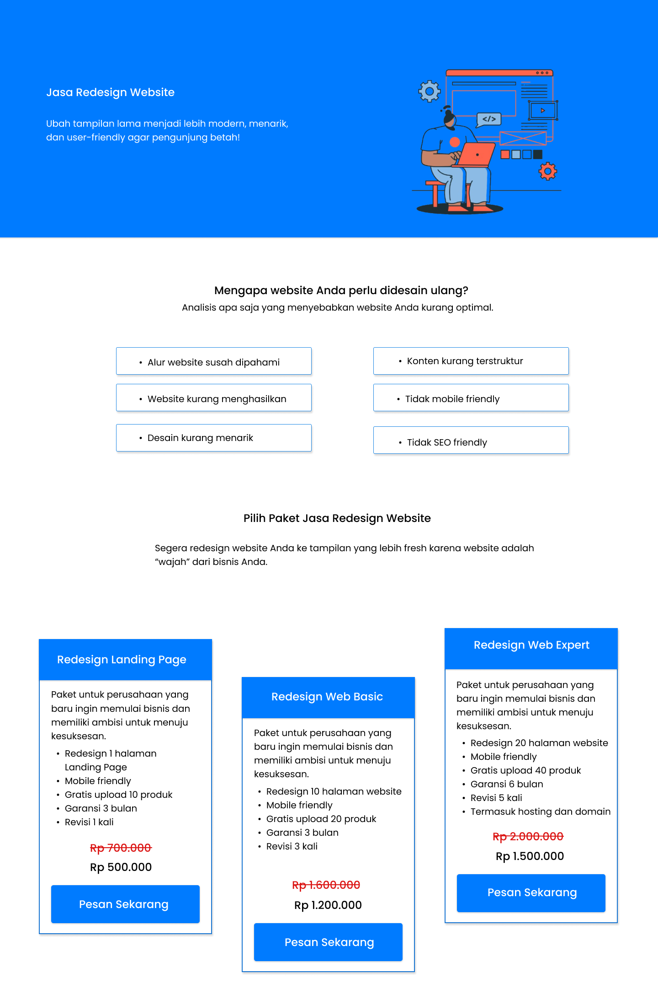
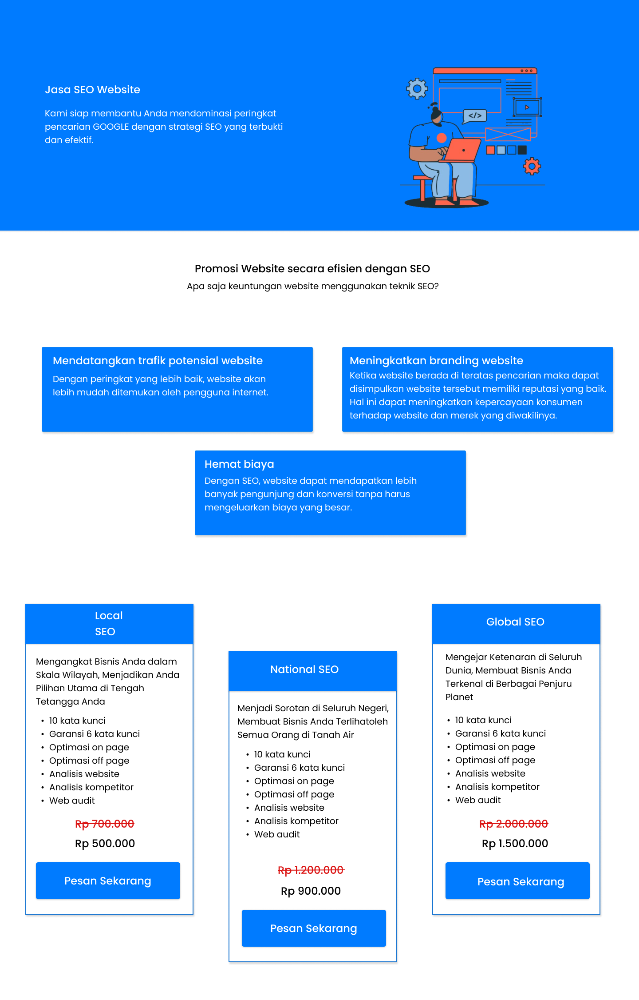

# 🚀 Landing Page Design Case Study

<div align="center">


**Modern Landing Page Design for Website Development Services**

Didesain untuk meningkatkan kredibilitas bisnis, membangun kepercayaan calon pelanggan, dan meningkatkan konversi melalui pengalaman pengguna yang intuitif.

</div>

---

## 📋 Table of Contents

* [Overview](#-overview)
* [Figma Design](#-figma-design)
* [Preview](#-preview)
* [Project Structure](#-project-structure)
* [Asset Documentation](#-asset-documentation)
* [Implementation Guide](#-implementation-guide)
* [Best Practices](#-best-practices)
* [Handoff Documentation](#-handoff-documentation)

---

# 🎯 Overview

Landing page ini dirancang untuk perusahaan jasa pembuatan website dengan fokus pada:

✨ Meningkatkan kredibilitas brand
✨ Menampilkan layanan secara jelas dan terstruktur
✨ Membangun kepercayaan calon pelanggan
✨ Mengoptimalkan konversi melalui CTA yang efektif
✨ Menyediakan pengalaman pengguna yang modern dan responsif

---

# 🎨 Figma Design

### 🔗 Design File

https://www.figma.com/design/Yeayrdkr0P4N53LNYM17Zw/Landing-Page?node-id=0-1&t=5zxXbXq4UgNjCEET-1

> Gunakan file Figma sebagai referensi utama untuk implementasi UI, pengambilan design tokens, spacing, typography, dan asset export.

---

# 🖼️ Preview

## Hero Section

### Beranda.png



**Deskripsi**

Ilustrasi utama yang digunakan pada Hero Section sebagai visual pembuka halaman.

**Penggunaan**

* Hero Banner
* Landing Header
* Branding Illustration

---

## Services Section

### Layanan.png



**Deskripsi**

Ilustrasi yang digunakan untuk memperkuat penjelasan layanan pembuatan website.

**Penggunaan**

* Services Section
* Feature Highlight
* Company Introduction

---

## Career Section

### LowonganKerja.png



**Deskripsi**

Visual pendukung untuk menampilkan informasi lowongan pekerjaan atau peluang karier.

**Penggunaan**

* Career Section
* Recruitment Banner
* Job Information

---

## Client Section

### OurClient.png



**Deskripsi**

Kumpulan logo klien atau partner yang menunjukkan kredibilitas perusahaan.

**Penggunaan**

* Client Showcase
* Trusted By Section
* Portfolio Section

---

## Pricing Section

### PriceList Assets







**Deskripsi**

Visual kartu paket layanan yang digunakan pada bagian Pricing.

**Rekomendasi Implementasi**

* Basic Package
* Professional Package
* Enterprise Package

> Disarankan memisahkan konten teks ke HTML agar mudah dikelola dan diintegrasikan dengan backend.

---

# 📁 Project Structure

```bash
project/
│
├── assets/
│   ├── Beranda.png
│   ├── Layanan.png
│   ├── LowonganKerja.png
│   ├── OurClient.png
│   ├── PriceList-1.png
│   ├── PriceList-2.png
│   └── PriceList-3.png
│
├── index.html
├── style.css
└── README.md
```

---

# 📦 Asset Documentation

| Asset             | Section  | Purpose              |
| ----------------- | -------- | -------------------- |
| Beranda.png       | Hero     | Main visual          |
| Layanan.png       | Services | Service illustration |
| LowonganKerja.png | Career   | Recruitment banner   |
| OurClient.png     | Clients  | Client logos         |
| PriceList-1.png   | Pricing  | Package card         |
| PriceList-2.png   | Pricing  | Package card         |
| PriceList-3.png   | Pricing  | Package card         |

---

# ⚙️ Implementation Guide

## Image Optimization

Untuk meningkatkan performa website:

### Convert to WebP

```bash
hero.webp
service.webp
client.webp
pricing.webp
```

### Lazy Loading

```html

```

### Responsive Images

```html

```

---

# 🎨 Design System

## Color Tokens

```css
:root {
  --primary-color: #0b7aff;
  --primary-dark: #0a66d1;
  --background-color: #ffffff;
  --surface-color: #f6f9ff;
  --text-color: #12324b;
}
```

---

## Typography

### Heading

```css
font-family: 'Poppins', sans-serif;
font-weight: 700;
```

### Body

```css
font-family: 'Poppins', sans-serif;
font-weight: 400;
```

---

# 📱 Responsive Breakpoints

```css
/* Mobile */
0px - 600px

/* Tablet */
601px - 900px

/* Desktop */
901px+
```

---

# 🧩 Component Mapping

| Component    | Class         |
| ------------ | ------------- |
| Header       | .site-header  |
| Hero         | .hero         |
| Service Card | .card         |
| Pricing Card | .pricing-card |
| Portfolio    | .project      |
| Job List     | .job-list     |
| Footer       | .site-footer  |

---

# ♿ Accessibility

Pastikan implementasi memenuhi standar aksesibilitas:

✅ Alt text pada seluruh gambar

✅ Kontras warna memenuhi WCAG AA

✅ Navigasi keyboard berfungsi dengan baik

✅ Struktur heading yang semantik

✅ Focus state pada tombol dan link

---

# ✅ Handoff Checklist

### Design

* [ ] Figma File
* [ ] Prototype Link
* [ ] Color Palette
* [ ] Typography Styles
* [ ] Grid System
* [ ] Component Library

### Development

* [ ] Optimized Assets
* [ ] Responsive Layout
* [ ] Accessibility Check
* [ ] SEO Friendly Structure
* [ ] Performance Optimization

---

# 🚀 Quick Start

1. Clone repository

```bash
git clone <repository-url>
```

2. Open project

```bash
cd project
```

3. Run locally

```bash
open index.html
```

---

<div align="center">

### ⭐ Designed with Figma

Crafted with attention to usability, accessibility, and modern web design principles.

**UI/UX Design • Responsive Design • User-Centered Design**

</div>
